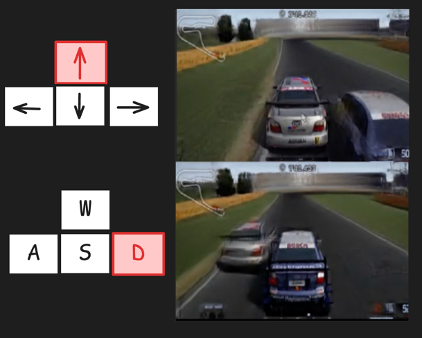

# Multiverse: The First AI Multiplayer World Model

🌐 [Enigma-AI website](https://enigma-labs.io/) - 📚 [Technical Blog](https://enigma-labs.io/) - [🤗 Model on Huggingface](https://huggingface.co/Enigma-AI/multiverse) -  [🤗 Datasets on Huggingface](https://huggingface.co/datasets/Enigma-AI/multiplayer-racing-low-res) - 𝕏 [Multiverse Tweet](https://x.com/j0nathanj/status/1920516649511244258) 

<div align='center'>
 <b>Two human players driving cars in Multiverse</b>
<br>
  
</div>

---

## Installation
```bash
git clone https://github.com/EnigmaLabsAI/multiverse
cd multiverse
pip install -r requirements.txt
```

### Running the model

```bash
python src/play.py --compile
```

When running this command, you will be prompted with the controls. Press `enter` to start:


Then the game will be start:
* To control the silver car at the top screen use the arrow keys.
* To control the blue car at the bottom use the WASD keys.



---


## Training

Multiverse comprised two models:
* Denoiser - a world model that simulates a game
* Upsampler - a model which takes the frames from the denoiser and increases their resolution

### Denoiser training

#### 1. Download the dataset
Download the Denoiser's training set from  [🤗 Huggingface](https://huggingface.co/datasets/Enigma-AI/multiplayer-racing-low-res).

#### 2. Process data for training
Run the command:
```bash
python src/process_denoiser_files.py <folder_with_dataset_files_from_step_one> <folder_to_store_processed_data>
```

#### 3. Edit training configuration

Edit [config/env/racing.yaml](config/env/racing.yaml) and set:
- `path_data_low_res` to `<folder_to_store_processed_data>/low_res`
- `path_data_full_res` to `<folder_to_store_processed_data>/full_res`

Edit [config/training.yaml](config/trainer.yaml) to train the `denoiser`:
```yaml
train_model: denoiser
```

#### 4. Launch training run

You can then launch a training run with `python src/main.py`.


### Upsampler training

#### 1. Download the dataset
Download the Upsampler's training set from  [🤗 Huggingface](https://huggingface.co/datasets/Enigma-AI/multiplayer-racing-full-res).

#### 2. Process data for training
Run the command:
```bash
python src/process_upsampler_files.py <folder_with_dataset_files_from_step_one> <folder_to_store_processed_data>
```

#### 3. Edit training configuration

Edit [config/env/racing.yaml](config/env/racing.yaml) and set:
- `path_data_low_res` to `<folder_to_store_processed_data>/low_res`
- `path_data_full_res` to `<folder_to_store_processed_data>/full_res`

Edit [config/training.yaml](config/trainer.yaml) to train the `denoiser`:
```yaml
train_model: upsampler
```

#### 4. Launch training run

You can then launch a training run with `python src/main.py`.


---

## Datasets

1. We've collected over 4 hours of multiplayer (1v1) footage from Gran Turismo 4 at a resolution of 48x64 (per players): [🤗 Huggingface link](https://huggingface.co/datasets/Enigma-AI/multiplayer-racing-low-res).

2. A sparse sampling of full resolution, cropped frames, are availabe in order to train the upsampler at a resolution of 350x530: [🤗 Huggingface link](https://huggingface.co/datasets/Enigma-AI/multiplayer-racing-full-res).

The datasets contain a variety of situations: acceleration, braking, overtakes, crashes, and expert driving for both players.
You can read about the data collection mechanism [here](https://enigma-labs.io/blog)

Note: The full resolution dataset is only for upsampler training and is not fit for world model training.

---

## Outside resources

- DIAMOND - https://github.com/eloialonso/diamond
- AI-MarioKart64 - https://github.com/Dere-Wah/AI-MarioKart64

